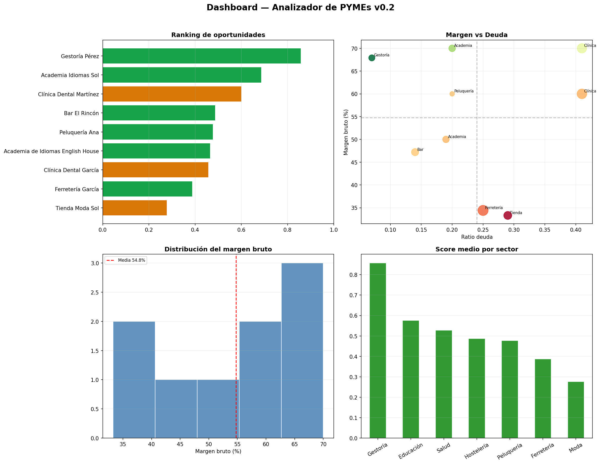

# Analizador de PYMEs

Herramienta para analizar la salud financiera de pequeñas y medianas empresas.

## Qué hace
- Calcula margen bruto, ratio de endeudamiento y facturación por empleado
- Asigna un nivel de riesgo financiero (bajo, medio, alto)

## Estado actual Semana 1
Versión 0.0 — análisis de una empresa individual con diccionario Python

## Estado actual — Semana 2
- Analiza 5 empresas simultáneamente con pandas
- Calcula 4 ratios financieros automáticamente
- Filtra y ordena empresas por criterios de inversión
- Comparativa sectorial con groupby
- Exporta resultados a CSV y Excel

## Analizador de PYMEs v0.1 — completado Semana 4
### Qué hace
- Analiza 7 empresas de distintos sectores
- Calcula 5 ratios financieros automáticamente
- Asigna scoring de riesgo con pd.cut()
- Genera ranking de oportunidades con puntuación 1-8
- Exporta a Excel con dos hojas (Ranking y Datos)

----------------------------------------------------------------------

## Analizador de PYMEs v0.2 — en progreso (Mes 2)
### Novedades respecto a v0.1 Semana 1
- Análisis estadístico completo del conjunto (describe, std, percentiles)
- Matriz de correlaciones entre variables financieras
- Análisis estadístico por sector (media, mediana, dispersión)
- Scoring por percentiles — más robusto que el scoring manual
- 9 empresas de 7 sectores distintos
- Dashboard visual con 4 gráficos matplotlib: ranking, scatter, histogramas, comparativa sectorial

## Dashboard visual Semana 2

El dashboard incluye:
- Ranking de oportunidades coloreado por nivel de riesgo
- Mapa de margen vs deuda (scatter plot)
- Distribución estadística del margen bruto (histograma)
- Score medio por sector (comparativa sectorial)

## Visualización interactiva — Semana 3

4 gráficos interactivos generados con Plotly. Descarga los archivos HTML y ábrelos en el navegador para explorarlos.

- **ranking_interactivo.html** — Ranking de las 9 empresas por score, filtrable por nivel de riesgo
- **scatter_interactivo.html** — Mapa de oportunidades margen vs deuda, coloreado por sector con hover completo
- **radar_empresas.html** — Perfil financiero comparativo de las 2 mejores empresas en 5 dimensiones
- **dashboard_interactivo.html** — Dashboard completo con ranking y scatter en dos paneles

Novedades respecto a Semana 2
- Gráficos HTML interactivos: hover, zoom y filtrado por sector desde la leyenda
- Radar chart con normalización de variables para comparativa multidimensional
- Dashboard interactivo exportable y compartible como archivo HTML

## Visualización interactiva — Semana 4
### Novedades respecto a Semana 3
- Descarga de datos fundamentales de empresas cotizadas comparables vía yfinance
- Fusión de PYMEs y cotizadas en un único DataFrame con columna tipo
- Gráfico comparativo interactivo de márgenes PYMEs vs cotizadas por sector
- Valoraciones orientativas por comparables sectoriales con descuento de liquidez del 30%
- Exportación a Excel con 4 hojas: Ranking v0.2, Estadística, Por sector, Valoraciones

### Comparables sectoriales utilizados
| Sector | Cotizada | Ticker |
|---|---|---|
| Hostelería | McDonald's | MCD |
| Moda | Inditex | ITX.MC |
| Salud | Fresenius | FRE.DE |
| Educación | Pearson | PSO |
| Ferretería | Fastenal | FAST |
| Gestoría | H&R Block | HRB |

### Archivos de esta semana
- **analizador_pymes_v02.xlsx** — Excel con 4 hojas listo para entregar a un inversor
- **comparativa_pymes_cotizadas.html** — Gráfico interactivo PYMEs vs cotizadas por sector

## ANALIZADOR DE PYMEs v0.2 - COMPLETADO MES 2

### Qué hace
- Analiza 9 empresas de 7 sectores distintos
- Calcula 5 ratios financieros automáticamente
- Estadística descriptiva completa: media, mediana, desviación, percentiles
- Análisis de correlaciones entre variables financieras
- Scoring estadístico por percentiles (más robusto que umbrales manuales)
- Dashboard visual con 4 gráficos: ranking, scatter, histogramas, sectorial
- Dashboard interactivo en HTML con Plotly
- Comparativas sectoriales: márgenes de PYMEs vs cotizadas del mismo sector
- Valoraciones orientativas usando PER sectorial con descuento de liquidez
- Exporta a Excel con 4 hojas y a HTML interactivo
 
### Próxima versión (Mes 3)
- Series temporales: datos de varios años en lugar de un snapshot
- Proyección de KPIs a 12 meses con Prophet
- Detección de estacionalidad en los ingresos

## Analizador de PYMEs v0.3 — MES 3
### Novedades respecto a v0.2
- Dataset temporal con 4 años de datos por empresa (2022-2025)
- Análisis de crecimiento compuesto (CAGR) e índice de calidad de crecimiento
- Proyección a 12 meses con Prophet e intervalos de confianza al 80%
- Tres escenarios por empresa: pesimista, central y optimista
- Detección automática de anomalías con z-score y bandas de control
- Dashboard temporal completo con 4 paneles
- Excel v0.3 con 4 hojas: ranking, crecimiento, proyecciones y alertas

### Próxima versión (Mes 4)
- Backtesting: ¿habría funcionado el scoring en datos históricos?
- Validación del modelo con vectorbt

